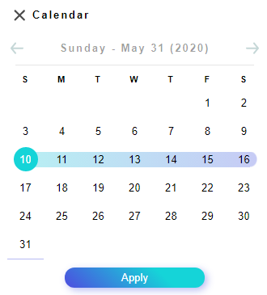

# Calendar Component
This is a Calendar that's in a drawer/modal. It was developed using only vanilla JS/HTML/CSS.


## How to use it
To add it to your project, just create it in the HTML page:

```
<div id="calendarDrawer"></div>
```

That is where the Calendar should be drawn.
And something clickable, like a button, that will trigger the modal. Something like this:

```
<button id="calendarDrawerButton"></button>
```

## Features
* You can select and receive a range of data to use for some filter or other things you want.
* Works both on web and smartphone (It works only on Cordova. The code needs it to differentiate mouse events from touch events)

### Note
* Don't forget to add the script and the css files to your HTML page
* If the icons don't load verify if the path to the folder where the icons are is correct